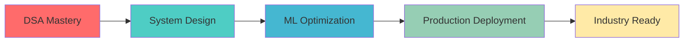

<div align="center">

# 👋 Hi, I'm Srushti Lakare


<p align="center">
  
  
  
</p>

</div>

---

## 🚀 About Me

```javascript
const srushti = {
    role: "Software Engineer in Making",
    education: "Computer Engineering Undergrad (2026)",
    focus: ["Artificial Intelligence", "Full Stack Development", "System Design"],
    currentlyLearning: ["DSA", "Deep Learning", "Scalable Systems"],
    funFact: "I turn coffee into code ☕ → 💻",
    mantra: "Build. Learn. Iterate. Deploy."
};
```

<div align="center">

### 🎯 What Drives Me

</div>

<table align="center">
<tr>
<td align="center" width="33%">

<br><b>AI/ML Enthusiast</b>
<br>Building intelligent systems that solve real problems
</td>
<td align="center" width="33%">

<br><b>Full Stack Developer</b>
<br>Creating end-to-end applications with modern tech
</td>
<td align="center" width="33%">

<br><b>Problem Solver</b>
<br>Transforming ideas into scalable solutions
</td>
</tr>
</table>

---

## 🛠️ Tech Arsenal

<div align="center">

### 💻 Languages & Core

<p>
  
</p>

### 🤖 AI & Machine Learning

<p>
  
</p>


### 🌐 Web Development

<p>
  
</p>


### 🗄️ Databases & Cloud

<p>
  
</p>

### 🧰 Tools & Platforms

<p>
  
</p>


</div>

---

## 📊 GitHub Stats

<div align="center">


</div>

<div align="center">

### 📈 Contribution Graph


</div>

---

## 🔭 Current Projects

<table align="center">
<tr>
<td width="50%">

### 🌾 FarmAI - Crop Advisory Platform


**Tech Stack:**
- MERN Stack
- CNN for Disease Detection
- Gemini API Integration
- Weather & Market APIs

**Features:**
- 🔍 Crop Disease Detection
- 📊 Market Trends Analysis
- ☁️ Weather Insights
- 💡 AI-Powered Advisory
- Soil Reprt Analysis
- Crop Calander
- Community Forum

</td>
<td width="50%">

### 🛡️ Fake Review Detection System


**Tech Stack:**
- Flask + React
- NLP (TF-IDF)
- Ensemble ML Models
- MongoDB

**Features:**
- 🤖 ML-based Detection
- 📈 Accuracy: 92%+
- ⚡ Real-time Analysis
- 📊 Visual Analytics

</td>
</tr>
</table>

---

## 🏆 Achievements & Certifications

<div align="center">

| 🎖️ Achievement | 📅 Year | 🏅 Type |
|----------------|---------|---------|
| Infosys Springboard Pragati Program | 2024 | Industry Certification |
| AI, Deep Learning & NLP Certified | 2024 | Technical |
| NPTEL Cloud Computing | 2024 | Academic |
| NPTEL IIoT Certification | 2025 | Academic |
| NPTEL Project Management | 2025 | Academic |
| Published Research Paper (Blockchain) | 2023 | Research |

</div>

<div align="center">

### 📜 Research Publication

**"Enhancing Trust and Privacy in Edge and Cloud Computing through Blockchain Technology"**


</div>

---

## 💼 Featured Projects Portfolio

<details>
<summary><b>🔹 Fake Product Review Detection System</b></summary>

<br>

**Problem:** Identifying fake reviews to enhance consumer trust

**Solution:** NLP-based detection system using ensemble learning

**Tech Stack:**
- Frontend: React.js
- Backend: Flask
- ML: TF-IDF, Naive Bayes, k-NN
- Database: MongoDB

**Impact:** 92%+ accuracy in fake review detection

</details>

<details>
<summary><b>🔹 AI-Driven Crop Advisory Platform (FarmAI)</b></summary>

<br>

**Problem:** Farmers lack access to AI-powered crop management tools

**Solution:** Comprehensive platform with disease detection & advisory

**Tech Stack:**
- MERN Stack
- CNN for image analysis
- Gemini API
- Weather & Market APIs

**Impact:** Real-time crop health monitoring and market insights

</details>

<details>
<summary><b>🔹 System-Level Backup Utility</b></summary>

<br>

**Problem:** Need for automated, scheduled backup solution

**Solution:** Streamlit-based backup tool with compression

**Tech Stack:**
- Python
- Streamlit
- File compression libraries
- Scheduling modules

**Features:** Automated scheduling, compression, restore functionality

</details>

<details>
<summary><b>🔹 Ratings & Reviews System</b></summary>

<br>

**Problem:** Secure review management with user authentication

**Solution:** Full-stack review platform with role-based access

**Tech Stack:**
- React.js
- Node.js/Express
- MongoDB
- JWT Authentication

**Features:** User authentication, CRUD operations, access control

</details>

---

## 🌱 Learning Journey

<div align="center">



</div>

**Current Focus Areas:**
- 📚 Data Structures & Algorithms  
- 🧠 Deep Learning Architectures
- 🏗️ System Design Fundamentals
- 🚀 Scalable Backend Development
- ☁️ ML Model Deployment & MLOps

---

## 📫 Let's Connect!

<div align="center">

<a href="https://www.linkedin.com/in/srushtilakare">
  
</a>
<a href="mailto:srushti1924@gmail.com">
  
</a>
<a href="https://github.com/SrushtiLakare">
  
</a>

</div>

---
 

<div align="center">


### ⭐ From [SrushtiLakare](https://github.com/SrushtiLakare) | Always Learning, Building & Growing 🚀

**Show some ❤️ by starring some repositories!**

</div>
